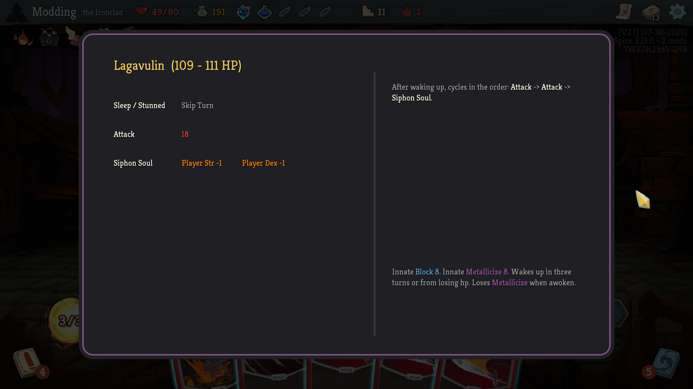
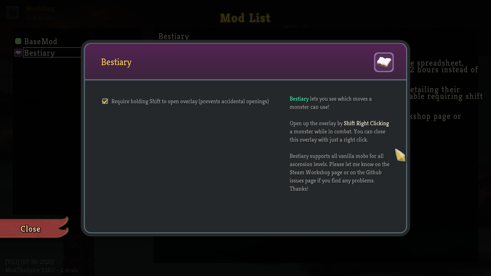

# Bestiary
Shift+Right click a monster while in combat to view its AI patterns and abilities. An overlay is provided for all vanilla monsters - across all ascension levels!

## Config

You can disable the *Shift* key modifier requirement in the Main Menu -> Mods -> Bestiary -> Config menu. This feature is enabled by default since it can be quite annoying to open up the menu if you right click while holding a card (e.g. canceling a card play after picking it up).

## Installation

* Steam Workshop Link: https://steamcommunity.com/sharedfiles/filedetails/?id=2285965269

* Manually: Requires ModTheSpire and BaseMod. Download the latest .jar file from the [Releases page](https://github.com/casey-c/bestiary/releases) and place it into the SlayTheSpire/mods folder.

## Bugs / Suggestions / Issues

Please leave feedback on the [Issues page](https://github.com/casey-c/bestiary/issues) if you run into any problems with the mod - especially missing or invalid details. This mod currently only supports the base game monsters as gathering the moveset data was extremely time consuming.

I also welcome any other suggestions or ideas to improve the mod on that page as well. Thank you!

## For Modders

If you have a mod with custom monsters or AI patterns and are interested in getting support for your own work - please let me know on the [issues page](https://github.com/casey-c/bestiary/issues). I didn't bother to write an API to expose access to the overlay yet as I don't know if there would be any interest. Please check out the *monsters.json* file in the source code of this repository for an idea of what kind of effort you'll need to undertake to make it happen. As a fair warning: it's a bit tedious - but if you're interesting in tackling it (I won't write a JSON for you), please drop a line and I can hopefully write some code you can hook into!
